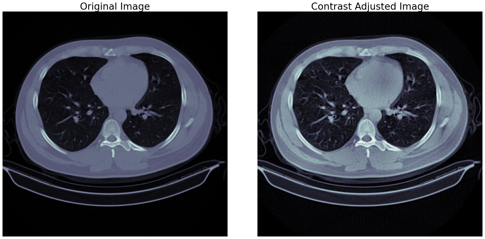
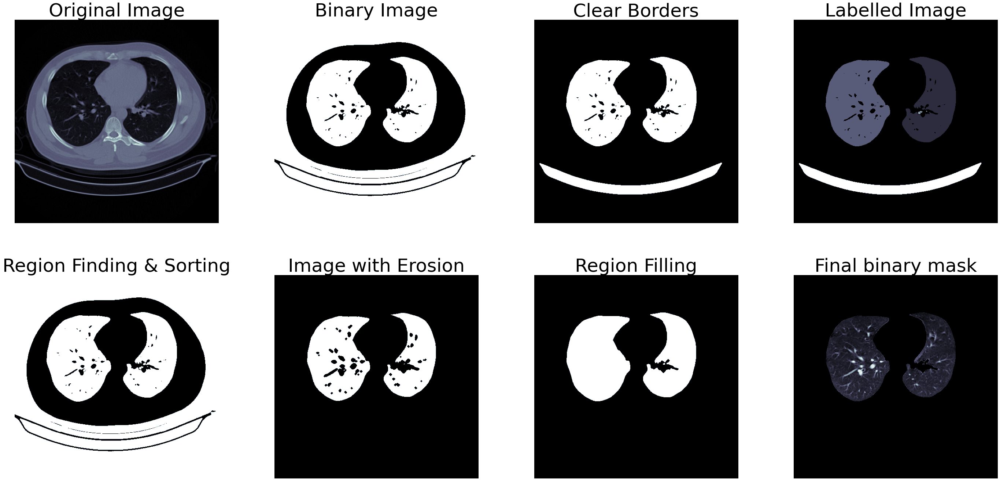
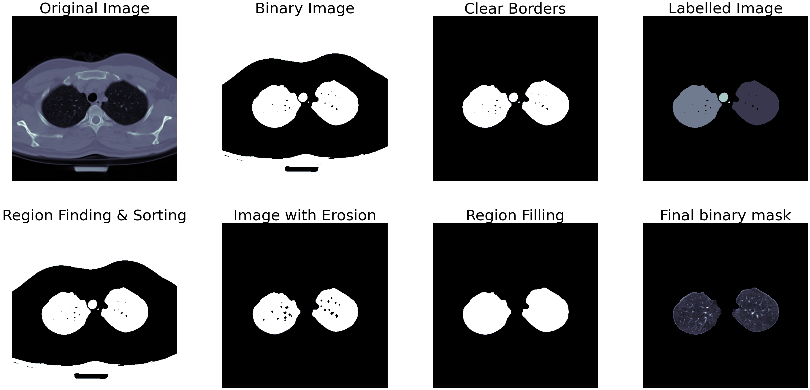
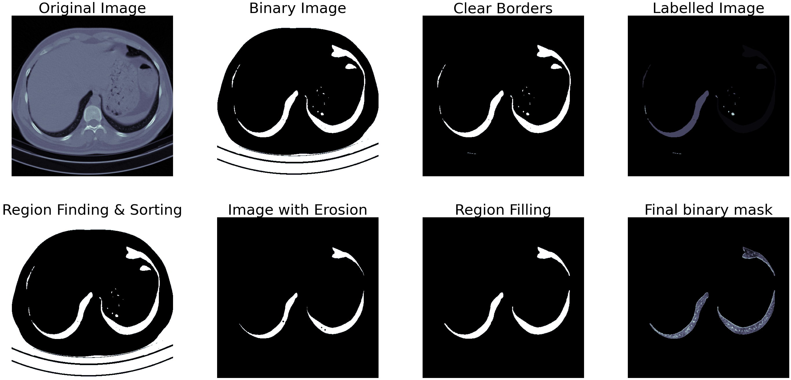
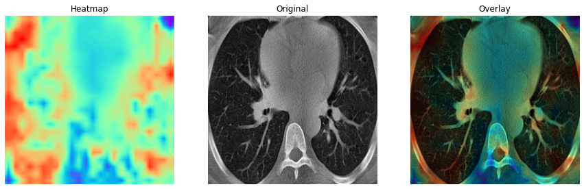
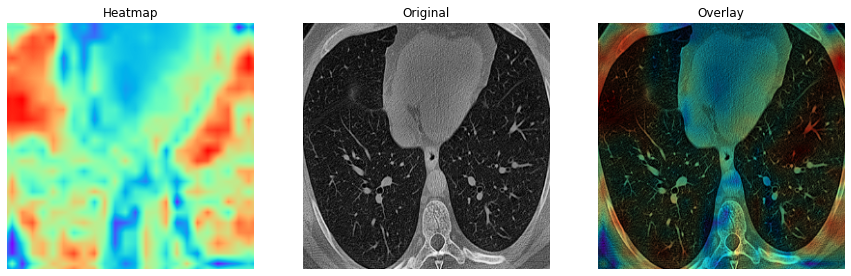

# Lung Disease Detection using CT Imaging with a focus on Image Pre-processing

A Computer tomography (CT) scan is a non-invasive medical imaging technique used by radiologists for medical diagnosis. A CT scan produces detailed images of different tissues inside a human body that helps to pinpoint areas that could be a cause of concern. 

We are in an unfortunate time plagued with a virus that affects the lungs and causes various complications that include but may not limit to severe cough, pneumonia, shortness of breath and lung degradation. Apart from this, there are other ways our lungs are damaged daily from pollution, smoking, pollen and other irritants. A healthy and well-maintained lung leads to a long life, and CT scans are the only way to detect the health of a lung. CT scans are especially useful in detecting lung diseases such as lung parenchyma, emphysema, and fibrosis. Generally, radiologists or oncologists review these CT scans for diagnostic purposes, which could take up much time as CT scans consist of multiple high-resolution slices or images.

Machine learning can aid these specialists in this diagnostic process, and it can leverage the usage of deep features with the help of neural networks. It can parallelly process multiple slices at once instead of one slice at a time. A machine may not replace a radiologist or an oncologist any time soon; however, it can significantly reduce their workload, especially when CT scans are done daily for hundreds of thousands of people.

## Dataset

The dataset, COVID-CTset [1], consisted only of a single disease, i.e. COVID-19, but it would suffice to generate a model to understand the features representative of lung disease if the classification has a significantly low loss. The collection includes the original CT scans of 377 people and consists of 15,589 and 48,260 CT scan images of 95 COVID-19 patients and 282 non-COVID (normal) patients (63,849 total images). As can be seen from the numbers alone, the dataset is unbalanced; however, it does represent a real-life scenario. The images are present in a TIFF format that encodes images in a 16-bit integer value compared to JPEG or PNG formats, which generally encode in an 8-bit integer and is a standard output from medical imaging devices that contains more information.

## Image Processing and Segmentation

The first step is to get the path of the images, group them based on their labels and arrange them in a CSV file for ease of processing. The image processing and segmentation pipeline then take an image through three steps.

### Contrast Adjustment

By adjusting the contrast of an image, the image gets mapped to its full range of possible values instead of clamped between specific values. For images, the entire range is between 0 to 1 or 0 to 255 for decimal and integer values, respectively. CT images are prone to low contrast due to how they get generated, so adjusting the contrast is almost necessary. This process also ensures that different objects present in the image are separable from the background or other objects.

The contrast limited adaptive histogram equalization (CLAHE) method for contrast adjustment is very effective as it considers different sections of images to generate multiple histograms used to distribute intensity values. Adjustments for smaller sections ensure that contrast levels are acceptable throughout the image instead of just one part being entirely separable and other parts merging into the background. A sample for this step is shown in the figure 1.

<figure>
  
  <figcaption align="center">
    <b>Fig.1 - Contrast Adjustment</b>
  </figcaption>
</figure>

### Segmentation

The classic approach to image processing-based segmentation is to generate a binary mask and then apply different algorithms to generate a mask that can separate the region of interest from the rest of the image. Otsu thresholding parameters for binarization are one way to achieve this binarization process. Much like CLAHE, the Otsu thresholding also considers intensity values for small sections of images and changes the thresholding values accordingly to separate the object from the background.

The Otsu binarization produces a detailed binary representation of the image as seen in figure 2, which requires additional processing to convert to masks. The first one is the border clearing algorithm, and this process removes unnecessary white pixels outside-in, starting from the borders till the algorithm encounters the next region of interest. The third image in figure 2 shows how the border clearing algorithm works.

After the above two steps, a fully-open or a partially-open chest CT image would produce two significant areas: the lungs themselves. Using area estimation methods, we can sort all the regions detected in the CT image and pick the two regions of the highest area. Labelling these images at this point would help remove other unnecessary regions. The fourth image in figure 2 shows the labelled regios identified by their areas.

Once the regions of interest are labelled, we can perform erosion on the generated mask to remove pixels from the edges of the regions. This process ensures the mask itself is a little smoother and does not contain pixels from the background or neighbouring regions. Erosion also creates and enlarges any holes that might be present in the binary mask, which is not ideal for producing a complete mask of the lungs. To address this issue region growing algorithm is used. This algorithm enlarges different regions of interest internally and fills all holes in the mask.

<figure>
  
  <figcaption align="center">
    <b>Fig.2 - Segmentation output</b>
  </figcaption>
</figure>

### Filter and Crop

Even though medical images are generally well-structured and uniform, there are bound to be a few instances where the above-mentioned steps would produce a wrong mask. In addition to this, some images may not contain a partially open or fully-open lung, and some images may contain such a tiny portion of a lung that it would not be efficient to run them through a classifier. We can detect and remove such instances using two steps - removing the images that are too wide or too narrow and comparing the area of white pixels to the black pixels in the binary mask.

<figure>
  
  <figcaption align="center">
    <b>Fig.3 - Segmentation output for small lung</b>
  </figcaption>
</figure>

To check for too wide or narrow segmentation shown in figure 3, we can check the width and height of the white regions in the mask and remove the ones that measure less than 45% of the other. This step removes the first set of lungs containing smaller sections of lungs lower down in the abdomen and other wrongly segmented images. If the image passes this step, the next step calculates the area occupied by the white pixels, and only the ones containing more than 12% of the total area then qualify as images containing a lung. An example of partially closed lung segmentation is shown in figure 4.

<figure>
  
  <figcaption align="center">
    <b>Fig.4 - Segmentation output for bad lung</b>
  </figcaption>
</figure>

The images are then cropped based on the generated mask
and the segregated into COVID and non-COVID classes.

The pre-processed dataset consists of 8,527 images and
31,105 for the COVID class and non-COVID class (39,632
total images), which is still an unbalanced dataset. These
images have reduced in size and the amount of information
they contain, making them suitable for classification. A helper
function reads the processed images separated into different
labels, resizes them to 256 × 256 pixels and splits them into
test and validation sets.

## Classification

The input of the networks would be cropped images of the chest CT scans containing the lungs rescaled to 256 × 256 pixels, and the output was the COVID and normal labels. We chose to create a network inspired by VGG models containing units of two to three stacked convolution layers pooled and fed to the next unit set.  Repeating these units in the network produces a set of features suitable for classification.

For this dataset and the size of the input, four such units consisting of two convolution layers and one max-pooling layer would be sufficient. Using batch normalization between these layers ensures that output remains to scale to ensure that the optimizer does not get stuck in local minima. The flattened outputs of the last unit become the input for a single dense layer consisting of 256 neurons. After another round of batch normalization, the final dense layers classify the images based on the probability scores. The network also consists of a dropout layer between the dense layers that randomly drops 20% of weights during training to curb overfitting. Table I represents the structure of the model while figure represents the scale of each layer and how they are connected.

| Layer              |         Output Shape |
| :----------------- | -------------------: |
| Rescaling          |  (None, 256, 256, 1) |
| Conv2D             | (None, 254, 254, 32) |
| Conv2D             | (None, 252, 252, 32) |
| MaxPooling2D       | (None, 126, 126, 32) |
| BatchNormalization | (None, 126, 126, 32) |
| Conv2D             | (None, 124, 124, 64) |
| Conv2D             | (None, 122, 122, 64) |
| MaxPooling2D       |   (None, 61, 61, 64) |
| BatchNormalization |   (None, 61, 61, 64) |
| Conv2D             |  (None, 59, 59, 128) |
| Conv2D             |  (None, 57, 57, 128) |
| MaxPooling2D       |  (None, 28, 28, 128) |
| BatchNormalization |  (None, 28, 28, 128) |
| Conv2D             |  (None, 26, 26, 256) |
| Conv2D             |  (None, 24, 24, 256) |
| MaxPooling2D       |  (None, 12, 12, 256) |
| BatchNormalization |  (None, 12, 12, 256) |
| Flatten            |        (None, 36864) |
| Dense              |          (None, 256) |
| Dropout            |          (None, 256) |
| BatchNormalization |          (None, 256) |
| Dense (Classifier) |            (None, 2) |
<b>Table 1 - Model structure</b>

## Highlights

The main highlight of the classifier is the heatmap it generates for the features extracted from the lung CT images which can be seen in figure 5 and 6. As evident from the COVID and non-COVID samples, the classifier can indicate and localize areas that might contain indications of lung diseases (indicated by bright-red patches). The classifier infers very little information from the outer areas of the lung to classify the images.

<figure>
  
  <figcaption align="center">
    <b>Fig.5 - COVID class activation map</b>
  </figcaption>
</figure>

<figure>
  
  <figcaption align="center">
    <b>Fig.6 - Non-COVID class activation map</b>
  </figcaption>
</figure>

## How to use

You would have to manually download the data and extract it to a directory. The `image_pipeline.ipynb` notebook contains the code for pre-processing the data and training the model and has the directory setup ready for you. Run the entire notebook to perform the contrast enhancement, segmentation, and filtering steps to generate a pre-processed dataset. The directory will be created if it does not exist. The `classification.ipynb` notebook contains the code for training the model and testing the model. This file also has the directory setup ready for you. It contains the code for 5 fold cross validation and saves the training and validation metrics, class activation maps, confusion matrix and classification report for for each fold in tensorboard. If you want to save the images separately, you have to make changes accordingly (it should be easy to do). Both the notebooks are have provisions for running in both local Jupyter and Google Colab environments.

## References

1. M. Rahimzadeh, A. Attar, and S. M. Sakhaei, “A fully automated deep learning-based network for detecting covid-19 from a new and large lung ct scan dataset,” Biomedical Signal Processing and Control, p. 102588, 2021. [Online]. Available:https://www.sciencedirect.com/science/article/pii/S1746809421001853